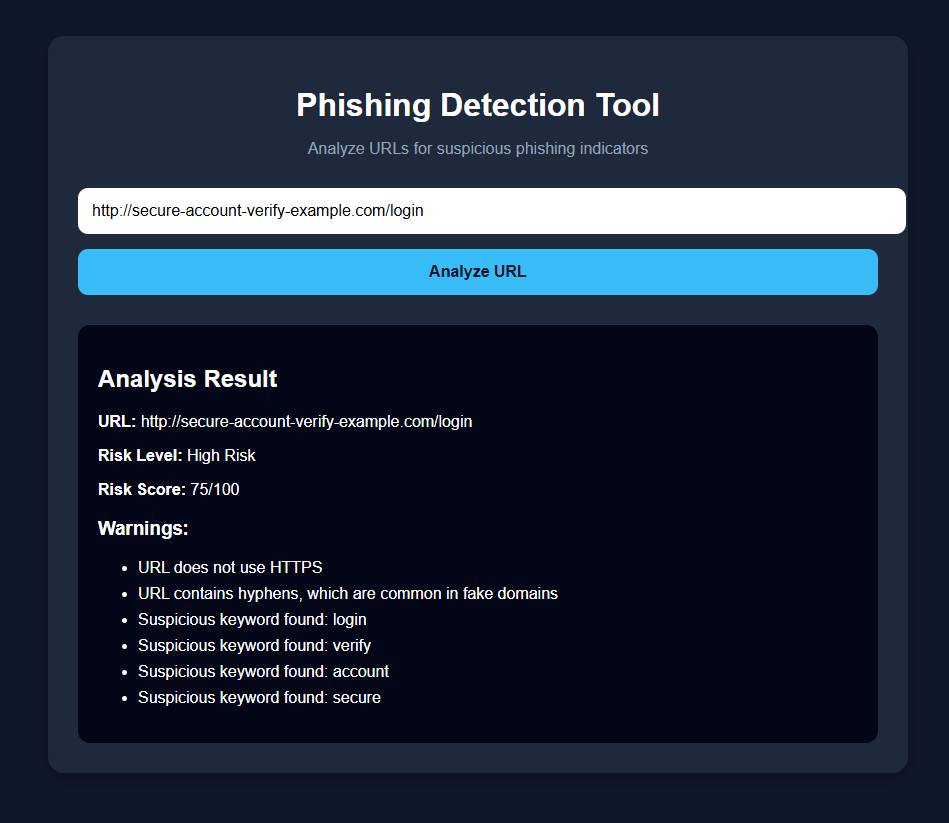

# Phishing Detection Tool

A Python and Flask web application that analyzes URLs for common phishing indicators and assigns a risk score.

## Overview

The Phishing Detection Tool analyzes URLs for characteristics commonly associated with phishing attempts. It generates a risk score, classifies the URL's risk level, and explains which indicators were detected.

## Demo

## Technologies Used

- Python
- Flask
- HTML/CSS
- URL Analysis

## Features

- Analyzes URLs for potential phishing indicators
- Checks whether HTTPS is being used
- Detects unusually long URLs
- Detects suspicious symbols and hyphens
- Checks for suspicious keywords
- Calculates a URL risk score
- Classifies URLs as Low Risk, Suspicious, or High Risk
- Displays specific warnings explaining the result

## Example

A test URL containing multiple suspicious indicators received a **75/100 High Risk** score.

Detected indicators included:
- No HTTPS
- Hyphens in the domain
- Suspicious keywords such as login, verify, account, and secure

## How It Works

The application evaluates several URL characteristics and adds points to a risk score when suspicious indicators are detected. The final score is used to classify the URL as Low Risk, Suspicious, or High Risk.

## Author

**Anmol Sandhu**  
B.S. Information Technology — Cloud Computing  
George Mason University | May 2027
